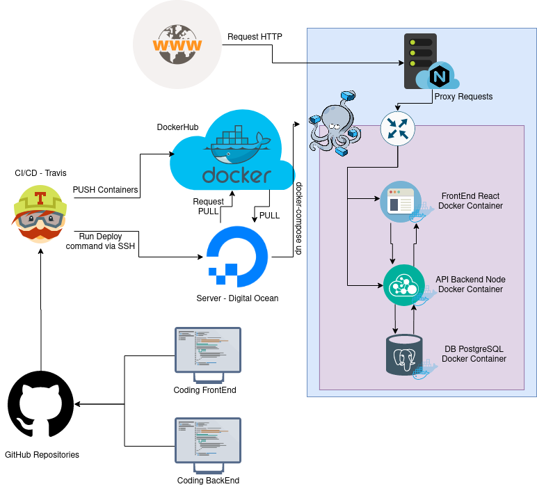

# Descripción de Arquitectura

Como se comentó en el documento de [Análisis y Comparativa de Arquitecturas],
la aplicación se divide en dos stacks tecnológicos:

* [API Backend][api-backend] desarrollado en [Node]
* [Frontend] desarrollado en [React]

En este documento nos vamos a enfocar tanto en la descripción
de la arquitectura _deployada_ en internet como en el proceso
de [Integración Continua] (CI) y [Entrega Continua] (CD).

## Diagrama Conceptual

## Continuous Integration

Tanto para el [Front][Frontend] como para el [Back][api-backend]
se mantiene el código fuente en sendos repositorios en [GitHub]
y se cuenta con un proceso de integración continua mediante [Travis].
Esta integración permite que en cada _push_ al repositorio se genere
una ejecución del _build_ que verifica la integridad de la aplicación.

En Travis se ejecuta:

* Proceso de [Lint] para verificar integridad de código.
* [Tests de Integración][integration-testing] para verificar funcionalidad.
* Análisis de [Coverage][code-coverage] para detectar falta de cobertura.

Además, como establecimos una [metodología de code review cruzado](README.md#metodologia-de-trabajo),
los fallos en los _builds_ de Travis bloquean los _Pull Requests_ hasta que el _build_ termine correctamente,
evitando que se integre en _master_ código con fallas explícitas, minimizando la posibilidad de bugs (si se mantienen las buenas prácticas de testing en el desarrollo).

## Continuous Delivery

### Servidor en la Nube

La aplicación se encuentra _deployada_ en un _[droplet]_ de [Digital Ocean].

Se registró el dominio [difi-covid.tk](difi-covid.tk) en [freenom] y se le asociaron los DNS
de [Digital Ocean] y la IP del _droplet_.

El _droplet_ tiene como _top level_ a [Nginx] como _server_ HTTP.

Por otro lado se utiliza [Docker Compose][docker-compose] como herramienta para contener
toda la arquitectura de la aplicación de manera de lograr establecerla
no solo en un ambiente _isolated_ sino también agnóstica del web server
donde se encuentre _deployada_.

_Docker Compose_ maneja 5 [Docker Containers][docker-container]:

* App Frontend (ver [Dockerfile][dockerfile-front])
  - Publica en `localhost:80`
* API Backend (ver [Dockerfile][dockerfile-back])
  - Publica en `localhost:8080`
* Backend Migrations Services
  - Usa el mismo container que API Backend pero en lugar de ejecutar la aplicación
    solamente ejecuta un script de migración para actualizar la base de datos.
  - No publica dado que se apaga luego de ejecutar las migraciones en la DB
* [DB PostgreSQL][postgres-hub]
  - No publica, solo es accesible por los _containers_ dentro del _compose_ en `db:5432`
* [Manager de DB][adminer-hub]
  - Publica en `localhost:8081`

Dado que los servicios dentro del _compose_ publican en `localhost` es necesario
establecer un mecanismo para publicar en la nube, más precisamente en el dominio
[difi-covid.tk](difi-covid.tk).

Para poder llegar desde internet hasta los containers se establece un sistema de _ruteo_
dentro del _server_ Nginx.

Se genera una configuración para el **front** en _nginx_, escuchando
en `difi-covid.tk:80` y `www.difi-covid.tk:80` y
_ruteando_ internamente a `localhost:80`.

De la misma forma se genera una configuración para el **back** en _nginx_,
escuchando en `api.difi-covid.tk:80` y _ruteando_ internamente a `localhost:8080`.

Por último, se genera una configuración para el **adminer** en _nginx_,
escuchando en `adminer.difi-covid.tk:80` y _ruteando_ internamente a `localhost:8081`.

### Deploy automático

> Parte de este mecanismo se generó
> basándose en el artículo [Travis CI Deployments to Digital Ocean][travis-ci-to-do]

Para mantener actualizados los servicios en la nube se generó un esquema
de deploy automatizado utilizando el mismo servicio de travis.

Al momento de generar el _build_ en travis, y **solo cuando se encuentre en la rama _master_**,
se activa el mecanismo de _deploy_ a la nube.

En cada repositorio (tanto en el back como en el front), lo primero que sucede (luego
de que hayan pasado los tests) es _buildear_ el container de docker desde travis.
Luego de que se haya _buildeado_ correctamente se _pushea_ el container
a [Docker Hub][docker-hub]. A continuación se ejecuta **remotamente** (vía _ssh_)
un _script_ de _bash_ que se encuentra en el servidor. Este _script_
se encarga de hacer _pull_ de todos los _containers_ que están en el _docker-compose_
para luego iniciar/reiniciar los servicios.

#### Cuestiones de seguridad

Hay varias cuestiones sensibles de seguridad involucradas en este proceso.
Por un lado se publican los containers en [Docker Hub][docker-hub]
y por el otro se accede remotamente al servidor mediante _ssh_.

Para poder publicar en [Docker Hub][docker-hub] se guardan de manera
segura las credenciales en Travis. Travis permite guardar variables
de forma cifrada, garantizando que no se visualicen durante los _builds_.

Ejecutar comandos _ssh_ es un poco más complejo. Para poder acceder
al servidor se necesitan dos cosas: contar con una con una clave pública
y una clave privada en travis, como así también guardar la clave pública del server
en travis para que se pueda ejecutar el comando.

Para contar las claves lo que se hace es generarla en la PC, y con la herramienta
de travis de consola **cifrar** la clave privada. Esta clave privada se guarda
**cifrada** en el repositorio. La clave pública se agrega al servidor.
En la corrida de travis se **decodifica** la clave privada para que pueda
ser usada en la ejecución.

## Resumen de Arquitectura

* Droplet en Digital Ocean (Ubuntu 16.04.6 LTS)
* Nginx (1.15.8) como Server HTTP y Routing interno
* Docker Compose (1.25.5)
  - Container Node para Back (node-13:alpine)
  - Container React para Front
  - Container Node (volátil) para Migrations
  - Container PostgreSQL para DB (12.3)
  - Container Administrador de DB (4.7.7)
* Travis como CI/CD
  - Generador Builds de Docker
  - Lanzador remoto de Deploy

## Notas sobre el Esquema de Autenticación y Seguridad

### JWT

La aplicación utiliza Json Web Token ([JWT]) como sistema de autenticación
y manejo de acceso a recursos. Particularmente utiliza la _library_ [node-jsonwebtoken].

Al momento del _login_ se genera un token para ese usuario. Ese token
permite, además de validar la sesión, acceder a los recursos que se exponen
desde el _backend_. Como se puede observar en los [endpoints](README.md#interfaz-api)
publicados por la API, los endpoints requiere validación de token para
retornar las respuestas. Quedan exceptuados los endpoints de _support_,
_registro_ y _login_. Support porque es información de consulta para
utilizar como soporte en los formularios. Login y Register por cuestiones obvias.

Además del token de usuario, existe otro tipo de token exclusivo para usuarios
administradores. Estos token permiten administrar las solicitudes.

No es posible, a nivel de usuario de front o consultas directas a la API
hacerse de un token de admin dado que la interfaz de API no expone en ningún
momento algún campo que permita hacerse pasar por admin. Los usuarios
administradores son creados directamente por nosotros directamente por base.

Por supuesto que ninguna aplicación está exenta de hacking, pero para nuestra
aplicación, y en esta instancia, creemos que las posibilidades de hacking están más
ligadas a la ingeniería social que a vulnerabilidades de la aplicación.

### CORS

> Fuente: [Cross-Origin Resource Sharing (CORS)][cors-mozilla]

Cors es un protocolo o estrategia requerida por los navegadores web
para evitar un tipo de ataque de denegación de servicios.
Es un mecanismo que utiliza cabeceras HTTP adicionales para permitir
que un _user agent_ (el navegador) obtenga permiso para acceder a recursos
desde un servidor pero en un origen (dominio) distinto al que pertenece.

Entonces, en cada pedido AJAX que se necesita ejecutar, el navegador
previamente envía a esa misma URL un request `OPTIONS` y en el campo
`Origin` pone el valor del dominio de la Web (ej, google.com).
Este valor difiere del valor desde donde efectivamente se hace
el pedido (ej, mi casa: 200.156.067.042).

Sin habilitación de CORS estas peticiones son tomadas como maliciosas y se bloquean.
Con CORS habilitado en el servidor se valida la existencia de estos
requests de dominios cruzados (_cross domain_) y según la estrategia configurada
le indica al navegador si puede continuar con las peticiones.

La especificación de CORS sugiere que los exploradores "verifiquen" la solicitud
solicitando métodos soportados desde el servidor con un método de solicitud
`HTTP OPTIONS` y luego, con la "aprobación" del servidor, enviar la verdadera
solicitud con el método de solicitud HTTP verdadero.

#### Situación en nuestra aplicación

Actualmente en la etapa inicial, con los primeros deployment,
optamos por tener una configuración CORS sin restricciones. O sea,
cualquier web, desde cualquier dominio podría, en principio, hacer
requests hacia la API. Esto no representa mayores problemas
dado que la aplicación no expone ni permite manipulación de
información sensible con los _token_ de usuario. La información
sensible (administración de peticiones) solo es posible manipularla
con token de administrador.

La idea es configurar CORS para que solo sea posible invocar request desde nuestro
dominio de la aplicación. La configuración no tiene complicaciones, solo es necesario
indicar él o los dominios desde donde queremos que se ejecuten los pedidos.

En conclusión, CORS no puede ser "apagado" dado que es algo que maneja el navegador
para todos los casos de aplicaciones _client rendering_, como es nuestro caso.
Si desde el back dejamos de validar CORS, ningún pedido puede ser ejecutado.

En los casos de aplicaciones _server rendering_, aún utilizando una API,
sí es posible deshabilitar CORS dados que los pedidos se harían internamente.

[adminer-hub]: https://hub.docker.com/_/adminer/
[Análisis y Comparativa de Arquitecturas]: Analisis-Arquitecturas.md
[api-backend]: https://github.com/unq-arqsoft-difi/covid-back-node
[code-coverage]: https://en.wikipedia.org/wiki/Code_coverage
[cors-mozilla]: https://developer.mozilla.org/en-US/docs/Web/HTTP/CORS
[Digital Ocean]: https://www.digitalocean.com
[docker-compose]: https://docs.docker.com/compose/
[docker-container]: https://www.docker.com/resources/what-container
[docker-hub]: https://hub.docker.com/
[dockerfile-back]: https://github.com/unq-arqsoft-difi/covid-back-node/blob/master/docker/Dockerfile
[dockerfile-front]: https://github.com/unq-arqsoft-difi/covid-front-react/blob/master/docker/Dockerfile
[droplet]: https://www.digitalocean.com/docs/droplets/
[Entrega Continua]: https://en.wikipedia.org/wiki/Continuous_delivery
[freenom]: https://my.freenom.com/
[Frontend]: https://github.com/unq-arqsoft-difi/covid-front-react
[GitHub]: https://github.com/
[Integración Continua]: https://en.wikipedia.org/wiki/Continuous_integration
[integration-testing]: https://en.wikipedia.org/wiki/Integration_testing
[JWT]: https://jwt.io
[Lint]: https://en.wikipedia.org/wiki/Lint_%28software%29
[Nginx]:https://www.nginx.com/
[node-jsonwebtoken]: https://github.com/auth0/node-jsonwebtoken
[Node]: https://nodejs.org/en/
[postgres-hub]: https://hub.docker.com/_/postgres/
[React]: https://reactjs.org/
[travis-ci-to-do]: https://kjaer.io/travis/
[Travis]: https://travis-ci.org/
