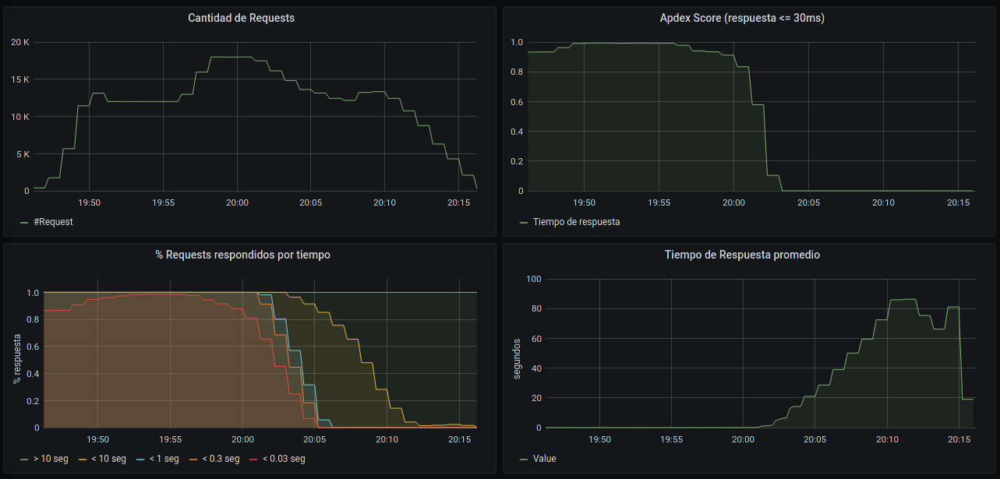

# Monitoreo

Para generar monitoreo con tests de carga se utilizó un sistema dockerizado mediante
docker-compose donde se establecen los siguiente servicios:

* API (con exportación de métricas de requests)
* DB Postgres
* Prometheus como recolector de métricas
* Grafana como visualizador
* Node-Exporter como sistema de exportación de métricas del sistema

Se puede visualizar el
[docker-compose utilizado](https://github.com/unq-arqsoft-difi/covid-api-use-cases/blob/v1.0.0/docker-compose.yml)
en el repositorio.

## Test de carga realizados

Se utilizó [Artillery](https://artillery.io/) como herramienta de generación de tests.

Se generaron dos suites de tests:

### Suite 1

Esta primer suite es simplemente una serie de requests de endpoints de _support_.
La utilizad es generar información básica y simple sobre datos estable que igual requieran
acceso a la base de datos.

```yaml
phases:
  - duration: 60
    arrivalRate: 5
    bame: Warm up
scenarios:
  - name: "Get support resources"
    flow:
      - get:
          url: "/support/areas"
      - get:
          url: "/support/institutions"
```

### Suite 2

Por el contrario, esta segunda suite genera:

* Registros de usuarios
* Login de los usuarios
* Pedidos de Insumos por parte de los usuarios
* Login del admin
* Consulta del admin sobre los pedidos obtenidos

La intención es no sólo generar los pedidos sino verificar el comportamiento
de visualización de pedidos a medida que van creciendo. De todas formas,
para que la aplicación no explote se generó paginado de visualización de pedidos.

```yaml
phases:
  - duration: 60
    arrivalRate: 2
    name: Warm up
  - duration: 120
    arrivalRate: 2
    rampTo: 15
    name: Ramp up load
  - duration: 420
    arrivalRate: 10
    name: Sustained load
  - duration: 420
    arrivalRate: 15
    name: Heavy
  - duration: 420
    arrivalRate: 12
    rampTo: 15
    name: Crash
scenarios:
  - post:
    url: "/users"
  - post:
    url: "/session"
  - post:
    url: "/request-supplies"
  - post:
    url: "/session"
  - get:
    url: "/request-supplies?status=Pending"
```

## Resultados 1: Sin limitación del sistema

Las pruebas se corrieron en un ambiente local (dockerizado, como se explicó al inicio)
con las siguientes características:

* CPU: Intel i5 con 4 cores
* Memoria: 16gb
* Disco: 500gb SSD

### Resultados

```txt
All virtual users finished
Summary report
  Scenarios launched:  17280
  Scenarios completed: 17280
  Requests completed:  86400
  Mean response/sec: 59.76
  Response time (msec):
    min: 1.1
    max: 126.8
    median: 9.3
    p95: 47.9
    p99: 63.1
  Scenario counts:
    Register user: 17280 (100%)
  Codes:
    200: 51819
    201: 34518
    400: 42
    401: 21
```

#### Mediciones de Respuestas


#### Mediciones de Uso de CPU y Memoria


## Resultados 2: Limitando los containers

Se limitaron los containers de la API y de la BD a

* 1 Core de CPU (cada uno)
* 2gb de Memoria (cada uno)

### Resultados

```txt
All virtual users finished
Summary report
  Scenarios launched:  17336
  Scenarios completed: 17336
  Requests completed:  86680
  Mean response/sec: 56.44
  Response time (msec):
    min: 1.2
    max: 35114.8
    median: 11.2
    p95: 11310.6
    p99: 28423.4
  Scenario counts:
    Register user: 17336 (100%)
  Codes:
    200: 51988
    201: 34632
    400: 40
    401: 20
```

#### Mediciones de Respuestas



#### Mediciones de Uso de CPU y Memoria


## Resultados 3: Bajando los niveles de carga

Para este experimento bajamos los niveles de carga dado que la
corrida anterior era muy intensiva. A su vez mantuvimos las limitaciones
de CPU y memoria descriptas en el experimento anterior.

```yaml
phases:
  - duration: 60
    arrivalRate: 2
  - duration: 120
    arrivalRate: 2
    rampTo: 5
  - duration: 420
    arrivalRate: 2
  - duration: 420
    arrivalRate: 3
  - duration: 420
    arrivalRate: 1
scenarios:
  - think: 5 # delay
  - post:
      url: "/users"
  - think: 2
  - post:
      url: "/session"
  - think: 3
  - post:
      url: "/request-supplies"
  - post:
      url: "/session"
  - get:
      url: "/request-supplies?status=Pending"
```

### Resultados

```txt
Summary report
  Scenarios launched:  3070
  Scenarios completed: 3070
  Requests completed:  15350
  Mean response/sec: 10.62
  Response time (msec):
    min: 1.9
    max: 115
    median: 8.5
    p95: 31.3
    p99: 45.6
  Scenario counts:
    Register user: 3070 (100%)
  Codes:
    200: 9207
    201: 6134
    400: 6
    401: 3
```

#### Mediciones de Respuestas


#### Mediciones de Uso de CPU y Memoria


## Conclusiones

Se puede visualizar que al limitar los recursos, a medida que crece
la cantidad de pedidos en simultáneo, se pierde capacidad de respuesta,
pasando de una mediana de respuesta de `9.3ms` con un máximo de `47.9ms`
a una mediana de respuesta de `11.2ms` pero con un máximo de `35114.8ms`.

Si bien la aplicación tarda en responder, notamos que el tiempo de servicio
(envío del request sobre la llegada de la respuesta) es mucho mayor, pero
no logramos generar gráficas que tengan esa medición porque no conseguimos
exportadores de métricas para prometheus compatibles con artillery, que es
desde donde deberíamos medirlo. En consecuencia las métricas se obtienen
desde el servidor pero no desde el cliente, para conocer la efectividad
del servicio que percibe el cliente.

Por otro lado, sabemos que hay ciertas definiciones a nivel aplicación
que podrían ser mejoradas pero no las hicimos adrede para analizar el comportamiento.
Principalmente, todos los requests a los endpoint de tipo `/support`
podrían _cachearse_ para evitar ir a la base de datos a buscarlos cada vez,
dado que son datos que no van a cambiar con frecuencia. Eso mejoraría
la performance de las respuestas y el consumo de recursos.

También notamos que cometimos un error en la aplicación cuando definimos
la paginación de los pedidos de insumos. Nos dimos cuenta sobre el final
que estamos haciendo paginación a nivel aplicación pero no a nivel base de datos.
Si bien estamos reduciendo el tráfico HTTP a enviar solo una parte de resultados,
la base de datos hace el pedido completo, y a medida que crecen los pedidos,
crece la demanda a la base y reduce la performance d ela aplicación
esperando los resultados de la base, llegando a tener consultas de miles
de pedidos que no solo consumen tiempo de respuesta de la base a la aplicación
sino también consumo de memoria de la aplicación al tener que guardarlos
todos en memoria para devolver luego solo una parte.